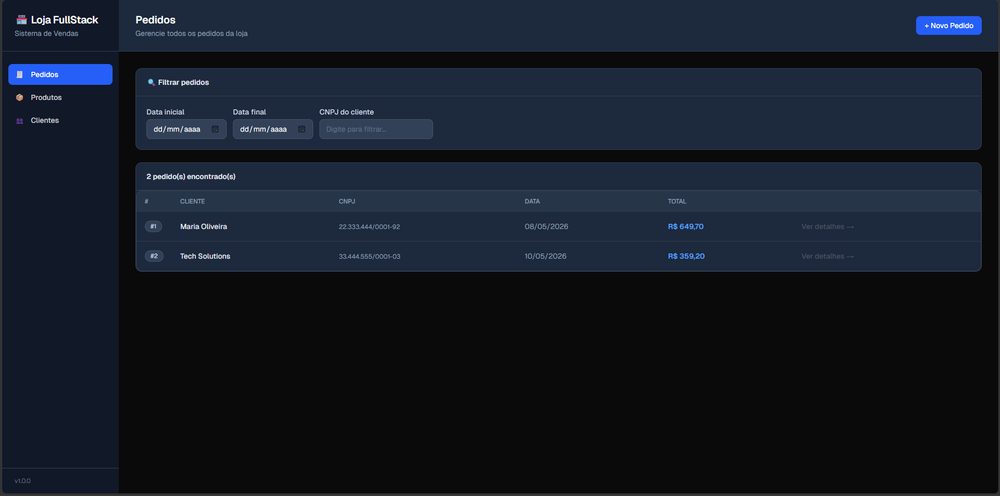
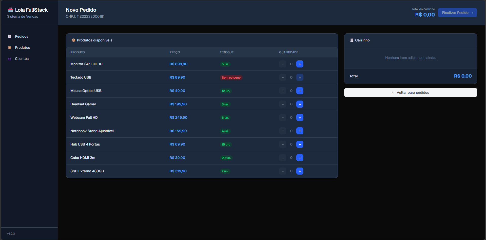
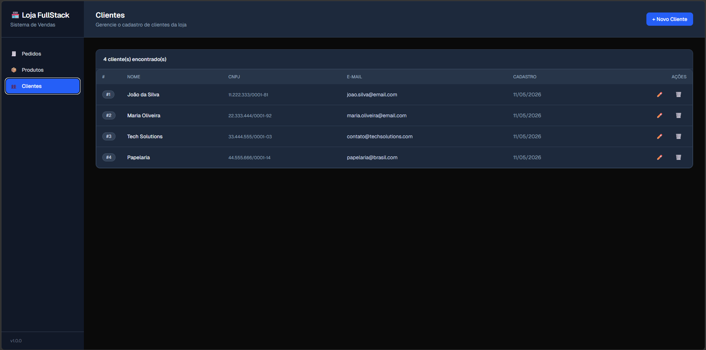
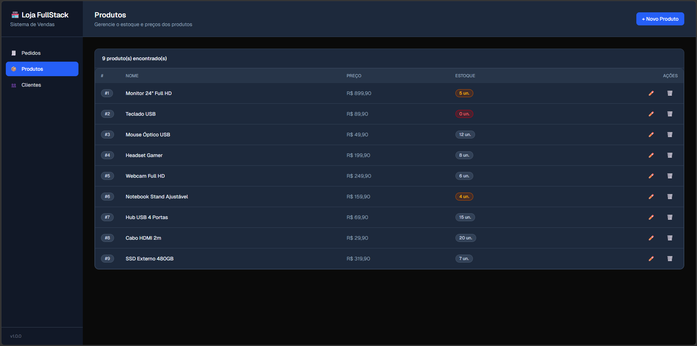

# loja-fullstack

## Intruções de deploy:

O projeto tem a seguinte estrutura de pastas:

```bash
loja-fullstack/
│
├── backend/         # .NET C# - API REST
│   ├── LojaFullStack.API/
│   │   ├── Dockerfile
│   │   └── ...
│   └── LojaFullStack.slnx
│
├── database/        # Banco de dados - SQL Server
│   ├── scripts/
│   │   └── 1_criacao_banco_loja.sql
│   │   └── 2_scripts_tabelas.sql
│   │── Dockerfile
│   └── entrypoint.sh
│
├── frontend/        # Next.js (React) - App Web
│   ├── src/
│   ├── Dockerfile
│   └── ...
│
├── docker-compose.yml # Orquestração dos 3 serviços
└── README.md
```

Para o deploy dos 3 containers, basta executar o seguinte comando na pasta raiz (loja-fullstack):

```bash
docker-compose up --build -d
```

**Importante:** O frontend será iniciado em localhost:4000, e o backend em localhost:5000, onde é possível acessar o swagger da API. O banco de dados é iniciado na porta padrão 1433, sendo possível configurar uma conexão usando o usuário 'SA' e a senha 'SenhaForte!123'.

Para um novo deploy do zero (fresh start) é necessário executar os seguintes comandos:

```bash
docker-compose down -v
docker-compose up --build -d
```

Também é possível executar cada serviço individualmente, com o Dockerfile de cada um.

## Database

```bash
cd database
docker build -t loja-db .
docker run -d -p 1433:1433 --name loja-db-container loja-db
```

Tabelas:


Diagrama:


Tabela Cliente:


Tabela Produto:


Tabela Pedido:


Tabela ItensPedido:


---

## Backend

```bash
cd backend\LojaFullStack.API
docker build -t loja-backend .
docker run -d -p 5000:5000 -e ConnectionStrings__DefaultConnection="Server=host.docker.internal,1433;Database=LojaDB;User Id=sa;Password=SenhaForte!123;TrustServerCertificate=True;" --name loja-backend-container loja-backend
```


---

## Frontend

**Importante:** Caso já esteja usando a porta 4000 em outra aplicação, o frontend deverá ser executado em uma porta diferente, como por exemplo a 4001.

```bash
cd frontend
npm run dev -p 4001
```

Tela Inicial/Pedidos:


Novo Pedido:


Tela de Clientes:


Tela de Produtos:

