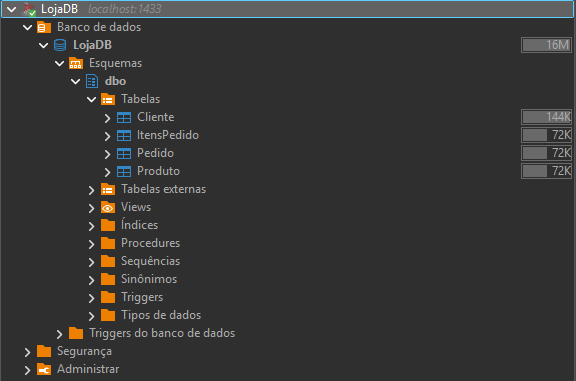
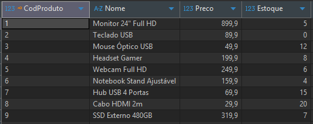
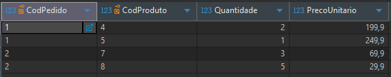
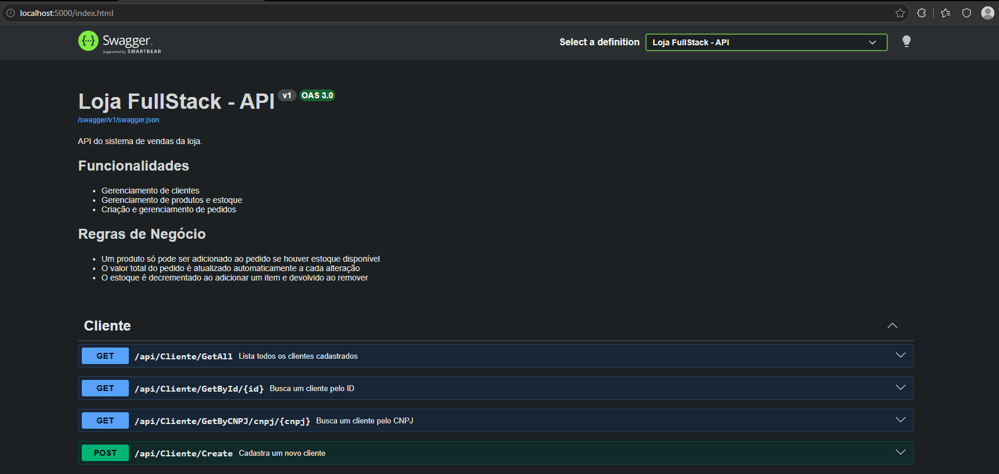

# loja-fullstack

Novo deploy (fresh start) com docker-compose:
```bash
docker-compose down -v
docker-compose up --build -d
```

## Database

```bash
cd database
docker build -t loja-db .
docker run -d -p 1433:1433 --name loja-db-container loja-db
```

### Tabelas:


### Diagrama:


### Tabela Cliente:


### Tabela Produto:


### Tabela Pedido:


### Tabela ItensPedido:


---

## Backend

```bash
cd backend\LojaFullStack.API
docker build -t loja-backend .
docker run -d -p 5000:5000 -e ConnectionStrings__DefaultConnection="Server=host.docker.internal,1433;Database=LojaDB;User Id=sa;Password=SenhaForte!123;TrustServerCertificate=True;" --name loja-backend-container loja-backend
```



---

## Frontend

```bash
cd frontend
npm run dev -p 4000
```


---

## Docker Compose

```bash
docker-compose up -d --build
```