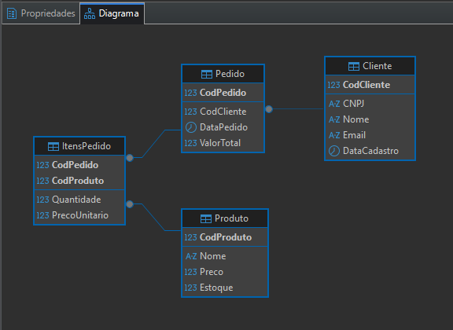
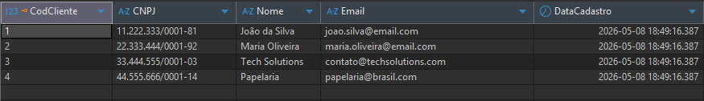
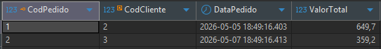

# loja-fullstack

## Database

Para rodar o banco de dados:

```bash
cd database
docker build -t loja-db .
docker run -d -p 1433:1433 --name loja-db-container loja-db
```

Diagrama:



Tabela Cliente:


Tabela Produto:


Tabela Pedido:


Tabela ItensPedido:

